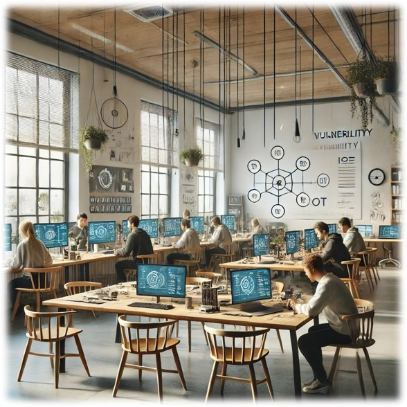

<!-- A bit of  HTML code for formatting. The rest is expected to be written in markdown. -->

<h1 align="center" position="relative">
   
  
   
   
  Research Title
   

  <!-- Below, there are some small button-like images. These are called "badges" and are popular on Github. You can create your own or edit the ones below. They are useful for adding quick links to external files or to add badges for your project. Each one consists of a link (`<a href=..`) and an `` tag. Edit the link to point to where you want. Delete the badges that you don't need. -->

  

  <a href="https://www.overleaf.com/read/...">
    <!-- You can edit the `Overleaf-paper` part in the next link to change the text of the created badge. -->
    
  </a>

  

  

  

  

   
</h1>

  <!-- The README template for projects at the Royal Hacking Lab -->

**Delete below from your repo**

## Team

- Supervisor: [Dr. Emre Süren](https://github.com/beyefendi)
- Active members: Yamini Balannagari
  

## Timeline

- Status: running :green_circle: (or pending :yellow_circle:, completed :orange_circle:)
- Started: 2025-01
- Ended: 2025-

## Parent project: Vulnerability Research of Mobile Applications Commonly Used in Sweden

## Abstract

The widespread adoption of mobile applications for critical services such as banking, transportation, healthcare, parking, and food delivery has heightened concerns about data security and user privacy. These applications manage vast amounts of sensitive information, making them prime targets for cyber threats. This research aims to systematically identify and analyze security vulnerabilities in five widely used mobile applications in Sweden—Foodora, Handelsbanken, SL, Apotek, and Betala P—through penetration testing, static and dynamic analysis, and reverse engineering techniques.

Building upon prior research in mobile application security, this study focuses on key areas such as data encryption, authentication mechanisms, session management, API security, and GDPR compliance. Utilizing advanced security assessment tools, including Burp Suite, MobSF, OWASP ZAP, Frida, and APKTool, the research will simulate real-world attack scenarios to uncover vulnerabilities that may compromise user privacy and financial security.

By employing a systematic penetration testing approach, this study seeks to provide actionable insights for developers, policymakers, and regulatory bodies to enhance security measures in mobile applications. The expected outcomes include a comprehensive vulnerability assessment report, security enhancement recommendations, and increased awareness among users regarding potential cyber threats. Ultimately, this research aims to strengthen the security posture of mobile applications, contributing to a more resilient digital ecosystem in Sweden.

## Illustration

## Video recording

 

  

- - - -
This project run by the [Royal Hacking Lab](https://lab.cybercampus.se) within the [Cybercampus Sverige](https://cybercampus.se)
