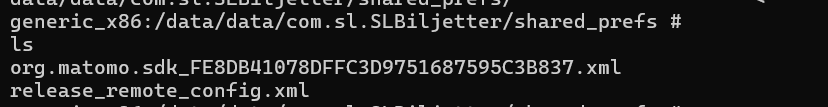
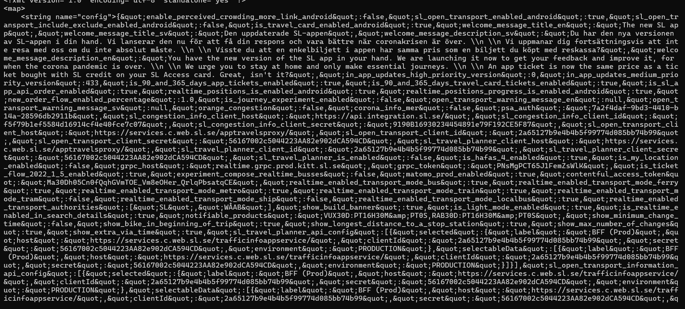
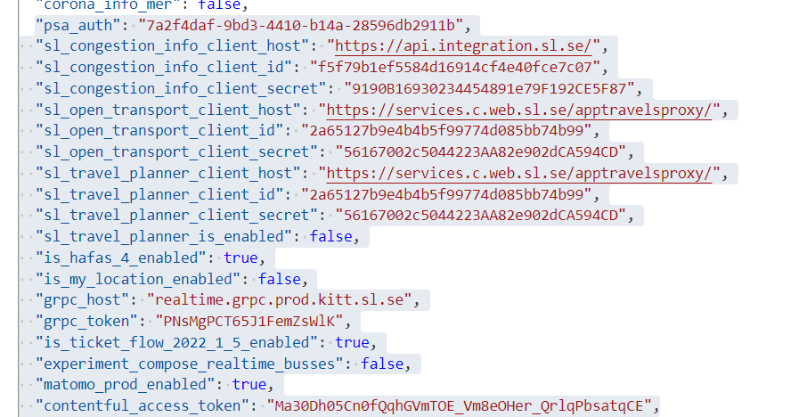
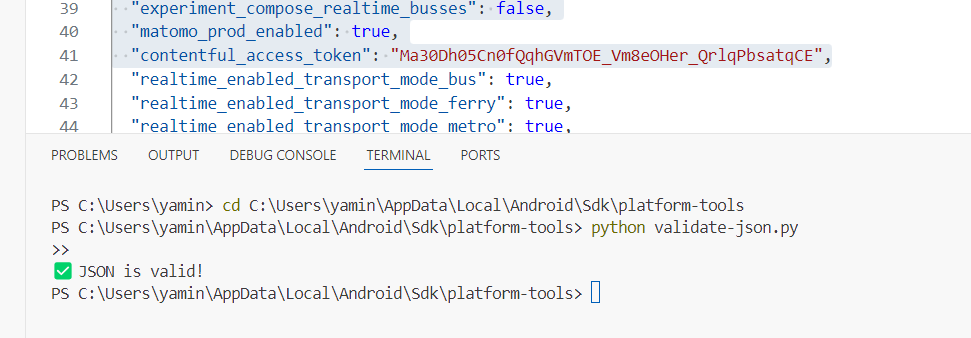
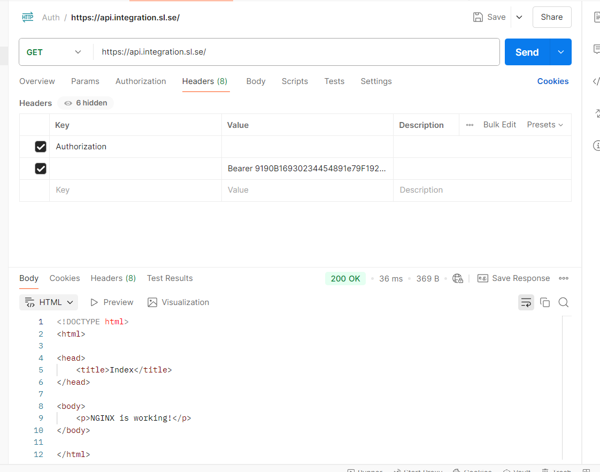
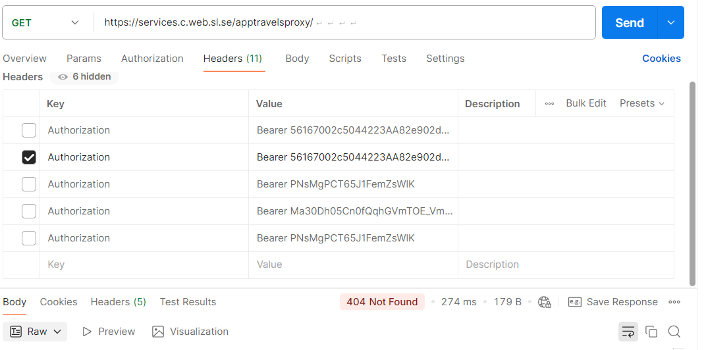
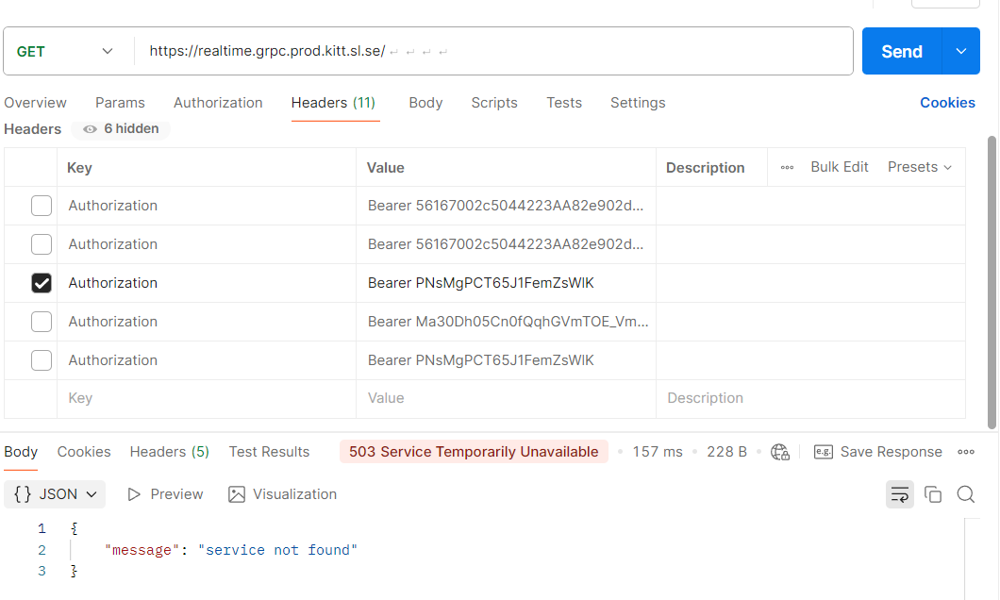
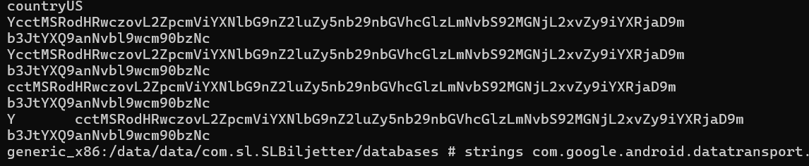
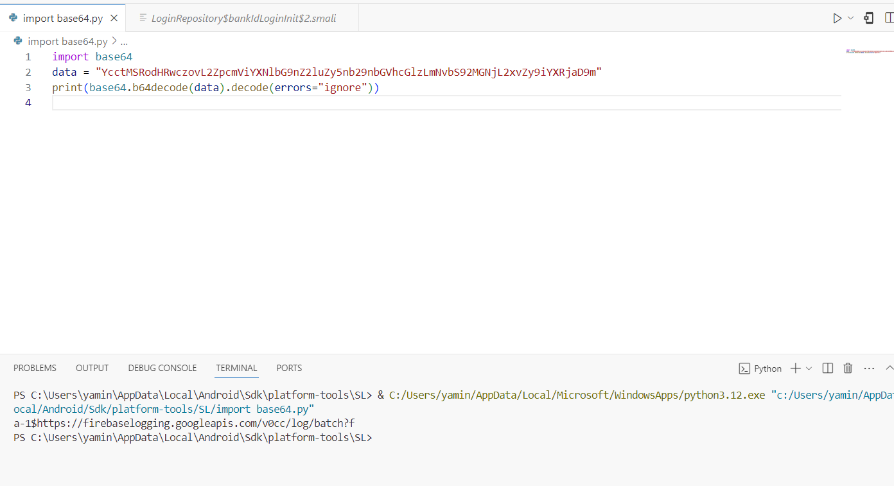
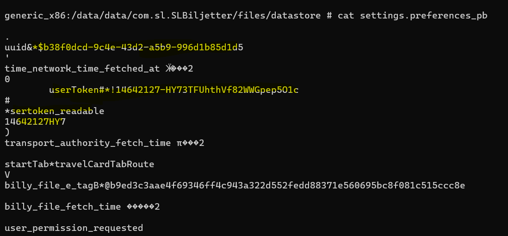

1.  Used **ADB Shell** to access the app’s internal storage:

    **adb shell**

    **su**

    **cd /data/data/com.sl.SLBiljetter/shared_prefs/**

    **ls**

    **cat release_remote_config.xml**

2.  Navigated to the app’s **Shared Preferences** directory and found

3.  Found **API keys and tokens** inside the release_remote_config.XML.

4.  Extracted **sensitive JSON data** from release_remote_config.xml (contained **API keys, secrets, tokens**). And The JSON contains multiple API keys and secrets, which, if valid, could allow unauthorized access to SL services.
5.  If "psa_auth" is an authentication key used for user authorization, an attacker could use it to gain unauthorized access to services.

    

6.  Then **Validated JSON using Python script**

    

7.  **Then testing API keys and secrets** by sending requests to the **SL APIs**

    

    

    

    \--A**ccessed the /databases folder** of the app then found something interesting in Base64 format

    

-   And tried debugging it.
-   
-   After thoroughly analyzing the SQLite database stored in the /no_backup/ directory of the Android app, I did not find any direct security vulnerabilities.
-   The database structure, including tables like WorkSpec, WorkProgress, and WorkTag, appears to be functioning normally.
-   Additionally, since the data is stored in an app-private directory (/data/data/com.sl.SLBiljetter/), it is already protected from unauthorized access unless the device is rooted.
-   However, while there are no immediate threats, best practices such as avoiding data exports to /sdcard/, ensuring proper backup before modifications.

    

    \-During analysis,I found that the Jetpack DataStore (\*.preferences_pb) files contain sensitive information, including authentication tokens (userToken, sertoken_readable), --JWT tokens, UUIDs, and tracking-related data.

    These tokens, if exposed, could potentially be used for unauthorized access, account hijacking, or user tracking.

    \- The fact that they are **stored in plaintext** without encryption poses a serious security risk, especially on rooted devices where an attacker could extract and misuse them
