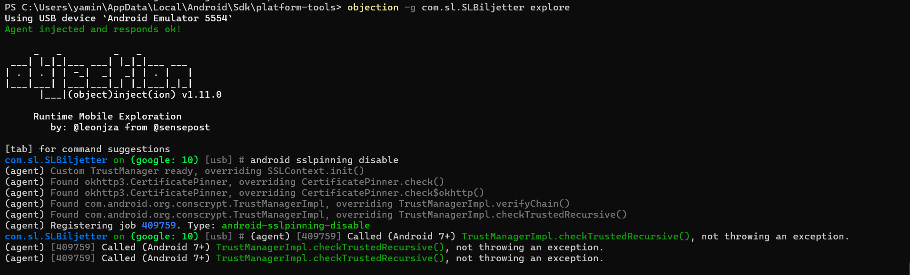
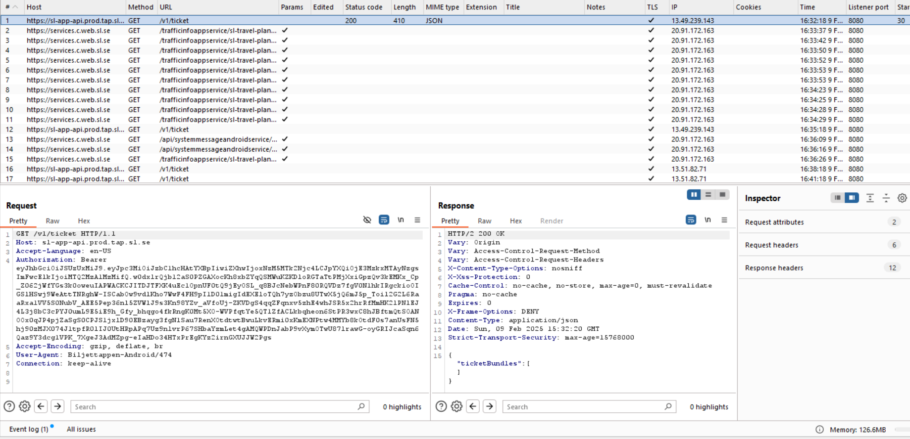

Intercepting the traffic of SL App

Sunday, 9 February 2025

16:38

1.  **Start Burp Suite:**
    -   Open Burp Suite and configure the proxy to listen on 127.0.0.1:8080 or another preferred port.
2.  **Export Burp CA Certificate:**
    -   Go to Proxy → Options → CA Certificate.
    -   Downloaded the certificate in der format
    -   Then push the certificate to android using
    -   Command : adb push certificate.crt /mnt/sdcard/
3.  **Configure Proxy on Android:**
    -   On your device, go to WiFi settings → Modify network → Advanced options.
    -   Set Proxy:
        -   Proxy Hostname: 10.0.2.2
        -   Manual
        -   Proxy Port: 8080.

**Step 2: Install and Configure Frida**

1.  pip install frida frida-tools

For transferring to the device: adb push frida-server /data/local/tmp/

1.  Set permissions and start the server:

adb shell

cd /data/local/tmp

chmod +x frida-server ./frida-server &

1.  Testing frida connection: frida-ps -U

**Step 3: Attach to the App and Disable SSL Pinning**

1.  For finding the package name: adb shell pm list packages \| findstr sl
1.  Attaching the app using objection

Install Objection : pip install objection

-   Start the app and attach objection: objection -g com.sl.SLBiljetter explore
-   Then disable SSL pinning: android sslpinning disable

And in the Burp Suite I can see the traffic is intercepted without any errors.

