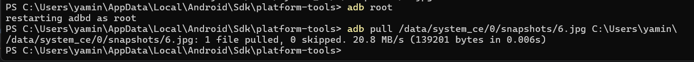
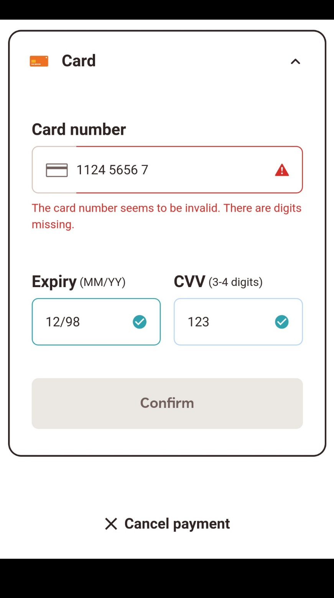

**Potential Vulnerability:**  
  
During my analysis, I found that sensitive payment card details (including card number, expiry date, and CVV) are being stored in plaintext within the /data/system_ce/0/snapshots/ directory on the device/emulator. This allows unauthorized access to payment information, violating security best practices and compliance regulations.

