Foodora\_ App

\- generic_x86:/data/data/se.onlinepizza/databases \# sqlite3 /data/data/se.onlinepizza/databases/pandora.db.perseus

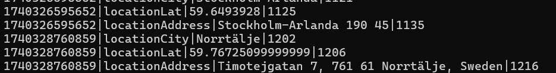

-   Storing precise location data (latitude, address, city) could expose user privacy if leaked.

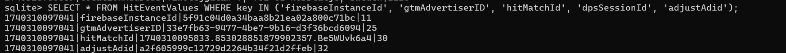

-   These identifiers could be used to track users across sessions or devices.

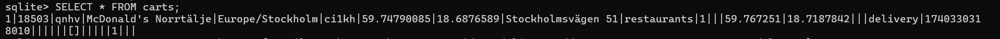

**This is a security vulnerability**, particularly because **user location data is stored in plaintext**, potentially exposing users’ **movements and order history**.

**push Notification Token**: The registration_id is a Firebase Cloud Messaging (FCM) token used for push notifications. If exposed, it could be used to send malicious notifications to the use

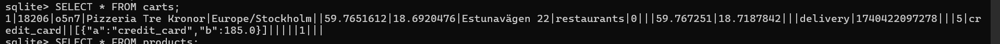

1.  **Plaintext Storage of Payment Data**:
    -   The carts table stores payment_method (e.g., credit_card) in plaintext.
2.  **Exposure of Vendor Details**:
    -   The carts table stores vendor_address (e.g., Estunavägen 22) in plaintext.
3.  **Lack of Encryption**:
    -   Sensitive fields (e.g., payment_method, vendor_address, user_id) are not encrypted.

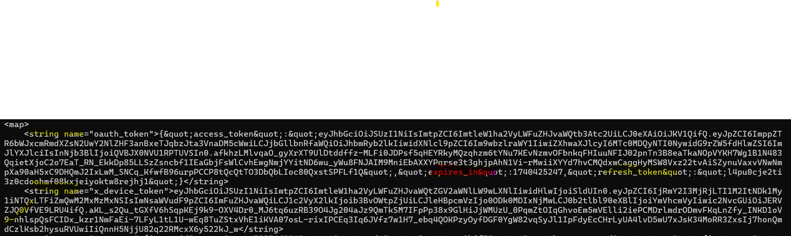

-   OAuth tokens (access_token, refresh_token), FCM tokens, and push notification tokens are stored in plaintext.
-   "id": "503546904",
-   "code": "opo9kif5",
-   "has_password": true,
-   "first_name": "Sasi",
-   "last_name": "Siva",
-   "email": "retirementgruhapravesham@gmail.com",
-   "mobile_number": "703227394",
-   "mobile_country_code": "+46",
-   "sms_verification_needed": false
-   }

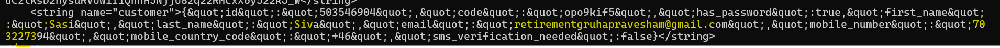

-   Email,user_id, mobile number, and full name are stored in plaintext.
-   **Tracking IDs**:
    -   Firebase, Crashlytics, and Google Ad IDs are stored in plaintext, enabling user tracking.

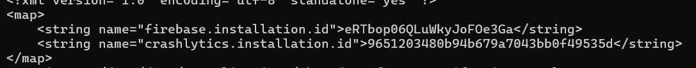

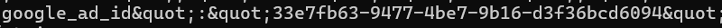

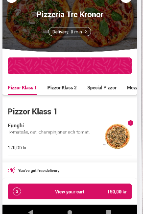

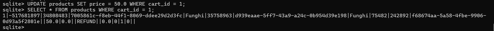

-   I set the price in the cart for that product is 50. So I added 3 in the cart and its updated to 150kr.

Despite utilizing various tools and techniques such as **Frida**, **Objection**, and **SSL pinning bypass scripts**, intercepting and modifying the **Foodora app** has proven to be highly challenging due to its robust security mechanisms. The app employs **certificate pinning**, a security feature that ensures it communicates only with trusted servers .

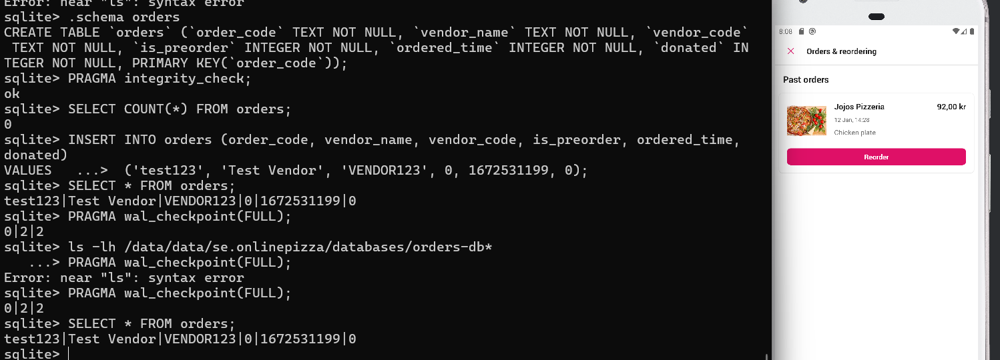

I tried inserting a order but its not getting reflected in the orders.
