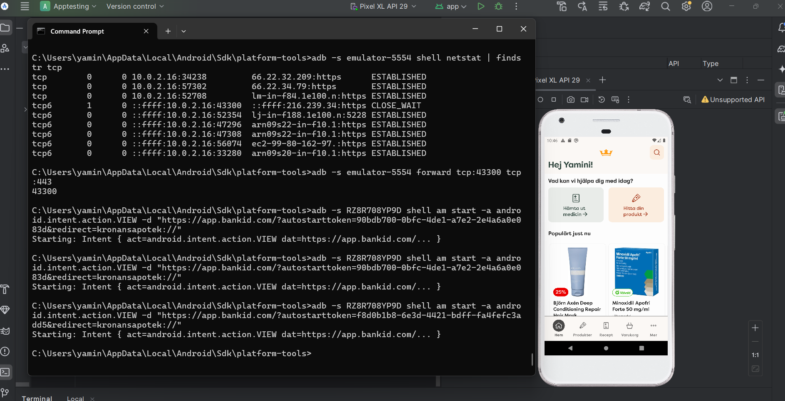
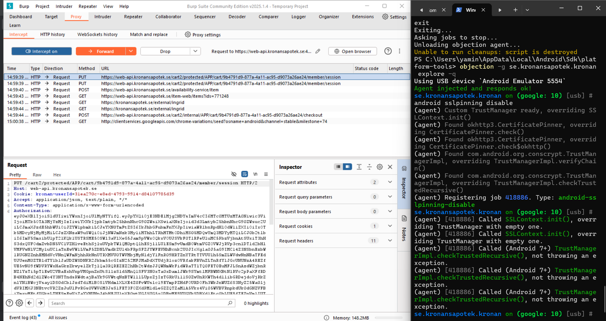
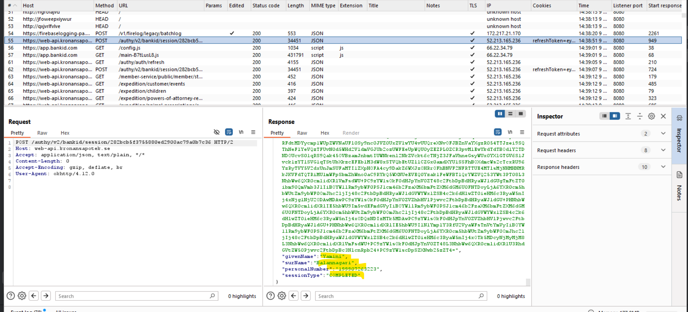
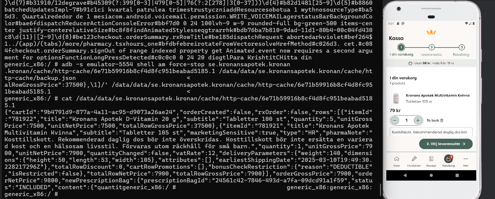
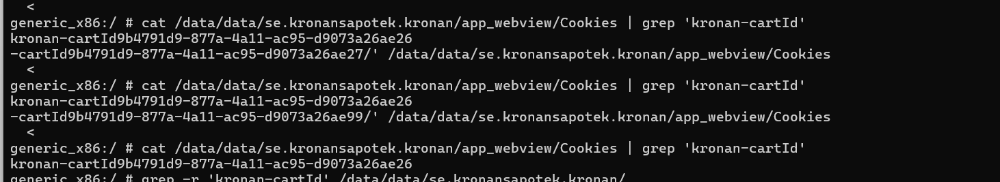

Kronans Apotek:

1.  RZ8R708YP9D → physical mobile device.

    emulator-5554 → emulator.

2.  Attempted to send an **intent** to open the **BankID app** on the mobile device using the provided link "https://app.bankid.com/?autostarttoken=90bdb700-0bfc-4de1-a7e2-2e4a6a0e083d&redirect=kronansapotek://"

-   I tried intercepting the traffic using Frida and Objection.

Attempted to add products, increase their quantities, and modify prices directly in the local cache files (/data/data/se.kronansapotek.kronan/cache/http-cache).

These changes were **visible locally** (in the modified files) but **did not reflect in the app**.  
Edited the cartId in local files to see if the app is vulnerable to unauthorized cart modifications.

The new cartId was saved locally, but **no changes were observed** in the app.

The app likely **syncs data with a remote server** and **validates cart information server-side** during each session.

Local modifications to cache files are not affecting the actual cart contents displayed in the app, indicating effective server-side validation and security mechanisms.
