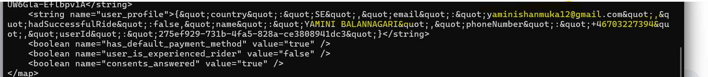
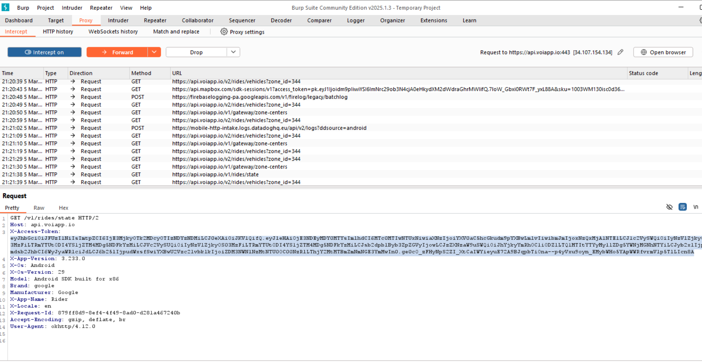
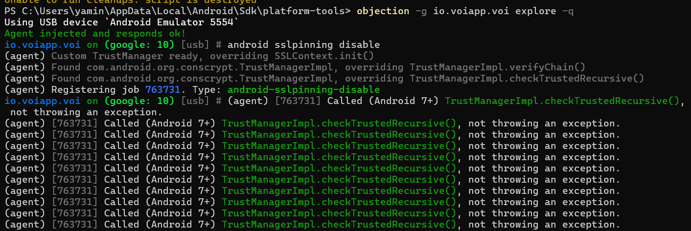
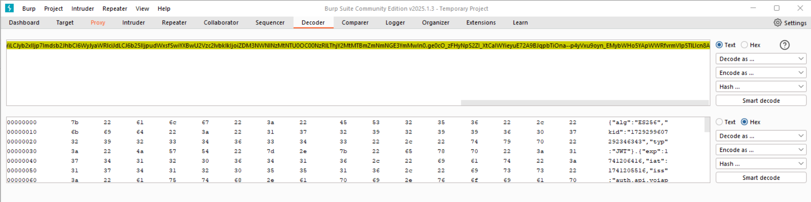
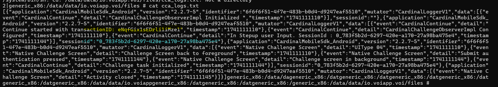

Voi App Vulnerabilities:

In shared_pref, I can find my email, name , mobile number and userId in plain text.

  
I can intercept the Voi App using Frida and Objection.

  

I can see the user-id and session ID is visible.  
  

These IDs can be exploited by attackers to **replay sessions** or gain unauthorized access and the Logs are stored in plain text.  
The log contains information about **3D Secure (3DS) authentication steps**:

-   Submit authentication pressed
-   Challenge task initialized

If this information is accessible, it could allow an attacker to **bypass or replay authentication**.
